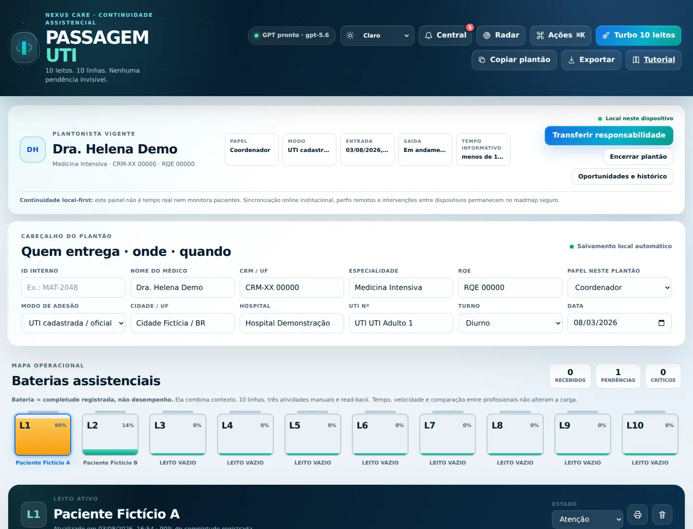
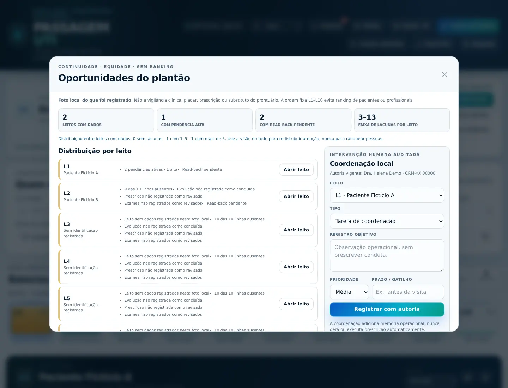
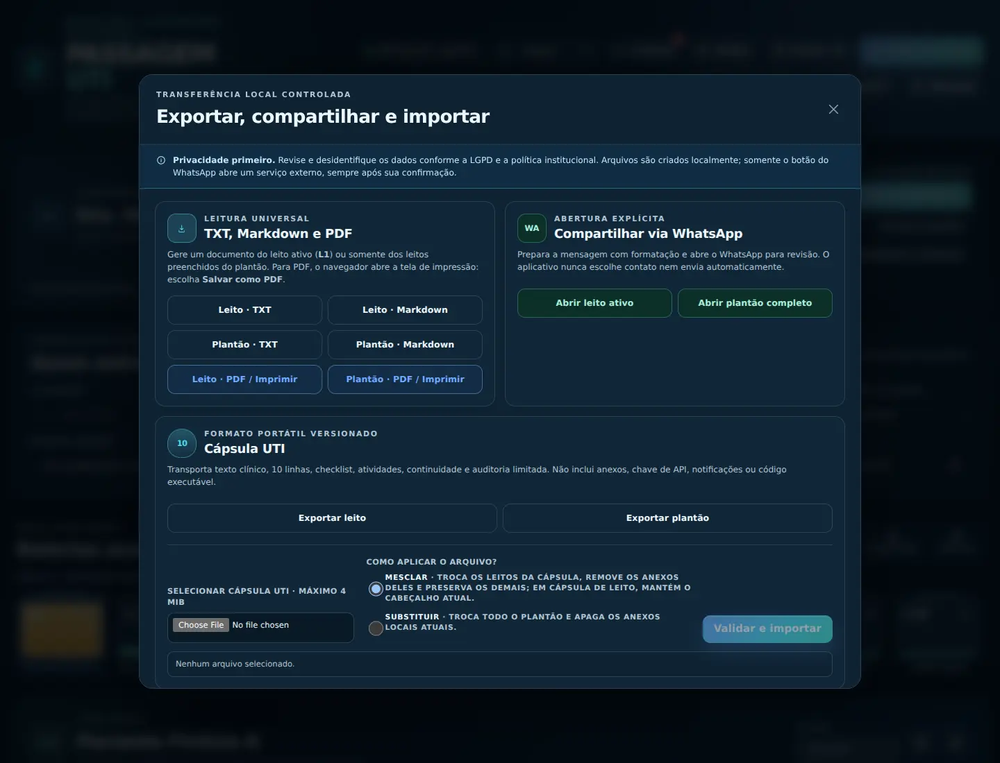

# Passagem UTI v5 — Cápsula UTI

Cockpit local-first para continuidade assistencial em UTI adulta: dez leitos, dez linhas objetivas por leito, arquivos locais, checklist dinâmico, read-back, exportações controladas e uma Cápsula UTI portátil.

> **Estado da versão:** candidato técnico a piloto com dados sintéticos. Não é prontuário eletrônico, prescrição, monitor multiparamétrico nem produto liberado para uso clínico em produção. A colaboração institucional online está documentada no roadmap, mas não está implementada nesta versão.

## O que já funciona

- **10 baterias assistenciais:** L1 a L10 mostram completude operacional, nunca velocidade ou “nota” do médico.
- **10 linhas fixas:** o GPT organiza apenas o material fornecido e explicita lacunas.
- **Entradas multimodais:** texto, PDF, imagem e documentos selecionados pelo usuário.
- **Cofre local por leito:** anexos permanecem no IndexedDB do navegador até uma análise explícita.
- **Checklist dinâmico:** prioridade, prazo/gatilho, sugestões da IA que exigem aceite e conclusão manual.
- **Linha do tempo e read-back:** atualizações do turno e confirmação estruturada do receptor.
- **Radar e Central:** visão operacional derivada dos registros locais; não são alarmes clínicos.
- **Modo Turbo:** até três análises concorrentes, com cancelamento e proteção contra respostas obsoletas.
- **Claro, escuro e sistema:** interface Turbo TEMI Premium responsiva e navegável por teclado.
- **TXT, Markdown, impressão/PDF e WhatsApp:** saídas revisáveis; WhatsApp só abre após confirmação e nunca envia sozinho.
- **Cápsula UTI:** arquivo `.capsula-uti.json` validado, sem chave, anexos, notificações ou código executável.
- **Continuidade local:** plantonista vigente, horário informativo, atividades por leito, oportunidades e intervenções de coordenação auditadas no dispositivo.

## Duas realidades, sem promessa enganosa

### Disponível agora — local neste dispositivo

O navegador mantém um único espaço de trabalho local. A Cápsula UTI permite levar um snapshot validado para outro navegador. Não existe sincronização em tempo real, login institucional, RBAC centralizado ou painel remoto nesta versão.

### Futuro — serviço institucional online

A “cápsula viva” multiusuário exige backend separado, autenticação forte, isolamento por instituição/UTI, autorização por função, auditoria imutável, criptografia, backup, resposta a incidentes e governança LGPD. A arquitetura proposta está em [`docs/ARCHITECTURE_ONLINE.md`](docs/ARCHITECTURE_ONLINE.md) e os bloqueios de lançamento em [`docs/LAUNCH_CHECKLIST.md`](docs/LAUNCH_CHECKLIST.md).

## Instalação local no macOS

Requisitos: Node.js 20 ou mais recente e uma chave válida da API da OpenAI.

1. Extraia o pacote do aplicativo em uma pasta sem credenciais.
2. Crie o arquivo `.env` em um dos caminhos privados abaixo:

   ```text
   ~/Documents/API KEY/passagem-plantao-uti/.env
   ~/Documentos/API KEY/passagem-plantao-uti/.env
   ```

3. O conteúdo do arquivo deve usar apenas o nome da variável, sem compartilhar o valor:

   ```dotenv
   OPENAI_API_KEY=cole_sua_chave_aqui
   ```

4. No Terminal, entre na pasta do app e inicie:

   ```bash
   npm start
   ```

5. Abra <http://127.0.0.1:4173>.

Como alternativa no Mac:

```bash
chmod +x start-mac.command
./start-mac.command
```

O arquivo de chave recebido neste projeto já circulou dentro de um ZIP e **deve ser rotacionado antes de qualquer piloto ou produção**. Nunca coloque `.env`, chave, cápsula clínica ou anexos no GitHub, Notion, Drive ou iCloud.

## Fluxo recomendado

1. Preencha o perfil profissional e o contexto do plantão.
2. Assuma o plantão no painel de continuidade local.
3. Selecione L1–L10 e identifique o leito conforme a política da instituição.
4. Cole o texto clínico e, se necessário, deposite arquivos no cofre.
5. Selecione explicitamente os anexos que entrarão na análise.
6. Gere as dez linhas e revise cada uma; ausência deve permanecer como não informada.
7. Aceite apenas sugestões de checklist aplicáveis.
8. Registre evolução, revisão de prescrição, revisão de exames e eventos do turno.
9. Use o painel de oportunidades para distribuir atenção entre os leitos, sem ranking profissional.
10. Confirme nome e prontuário/ID, faça o read-back e exporte pelo canal aprovado pela instituição.

Limites por análise: até 8 anexos selecionados, 15 MB por arquivo, 22 MB no total e 120.000 caracteres de texto clínico. A Cápsula UTI é limitada a 4 MiB e não transporta anexos.

Antes de salvar ou enviar um anexo, navegador e servidor aplicam o mesmo contrato: extensão/MIME permitido, base64 canônico, assinatura de arquivo, bloqueio de HTML/SVG/executáveis disfarçados e estrutura mínima de OOXML/ODT. Isso reduz contornos comuns, mas **não substitui antivírus, sandbox de documentos ou política institucional de arquivos**.

## Exportação e Cápsula UTI

- **TXT:** leitura simples e universal.
- **Markdown:** documento estruturado para conhecimento e documentação.
- **PDF:** use **Imprimir / Salvar em PDF** no navegador.
- **WhatsApp:** prepara e abre uma mensagem após confirmação; o usuário escolhe destinatário e envia manualmente. Verifique política institucional, minimização e desidentificação.
- **Cápsula UTI:** exporta um leito ou o plantão. Na importação, o app valida schema, tamanho, datas, IDs e contexto; read-back é invalidado. Leitos importados têm seus anexos locais anteriores removidos para impedir mistura entre pacientes.

A Cápsula UTI é um snapshot transportável, não o registro oficial. O formato está descrito em [`docs/CAPSULA_UTI_SPEC.md`](docs/CAPSULA_UTI_SPEC.md).

## Segurança clínica e privacidade

- Toda saída exige revisão médica; IA não executa condutas.
- Sugestões de checklist permanecem inativas até aceite humano.
- Classificação sugerida pela IA não muda o estado definido pelo médico.
- Mudança material invalida o read-back.
- Resposta recebida depois de alteração do leito é descartada.
- A chave fica no serviço local e nunca entra no JavaScript do navegador.
- As chamadas da API usam `store: false`, mas a instituição ainda deve avaliar contratos, base legal, minimização, retenção e transferências aplicáveis.
- O modo manual continua disponível sem IA.
- Notificações, Radar e oportunidades são memória de processo; não detectam deterioração nem substituem vigilância à beira-leito.

Antes de um piloto clínico, conclua o safety case, RIPD/RoPA, avaliação regulatória, threat model, testes de isolamento, acessibilidade, fluxo de incidente e aprovações institucional, jurídica, de privacidade e segurança.

## Desenvolvimento

Não há dependências de produção. O servidor usa APIs nativas do Node.js.

```bash
npm test
npm run test:e2e
npm start
```

Variáveis:

| Variável | Finalidade | Padrão |
|---|---|---|
| `OPENAI_API_KEY` | Credencial server-side | cofre privado em Documentos |
| `OPENAI_ENV_FILE` | Caminho alternativo do `.env` | vazio |
| `OPENAI_MODEL` | Modelo da Responses API | `gpt-5.6` |
| `PORT` | Porta local | `4173` |

O servidor fica fixo em `127.0.0.1`; esta RC não oferece opção para expor a chave ou a API local na rede.

## Mapa do repositório

- `index.html`, `styles.css`, `app.js`: cockpit, persistência local, continuidade e exportações.
- `attachment-contract.mjs`: contrato defensivo compartilhado de anexos no navegador e servidor.
- `server.mjs`: servidor loopback, chave server-side e integração Responses API.
- `assets/`: marca e ícones locais.
- `tutorial.html`, `tutorial.css`, `output/pdf/`: tutorial navegável e versão para impressão.
- `tests/`: contratos clínicos, segurança do servidor, cápsula e fluxos locais.
- `docs/`: PRD, arquitetura, LGPD, safety case, threat model, monetização, protocolo de piloto e governança de sincronização.
- `docs/assets/concepts/`: conceitos visuais com dados fictícios.

Comece por [`docs/PRODUCT_BRIEF.md`](docs/PRODUCT_BRIEF.md), [`docs/PRD_V5.md`](docs/PRD_V5.md) e [`docs/REPOSITORY_MAP.md`](docs/REPOSITORY_MAP.md).

## Galeria verificada

As imagens abaixo são capturas reais da RC1 com dados totalmente sintéticos. Os mockups de direção futura permanecem separados em [`docs/assets/concepts/`](docs/assets/concepts/) e nunca contam como prova de implementação.







Veja também o [relatório de QA](docs/QA_REPORT_V5.md), o [tutorial navegável](tutorial.html) e o [PDF ilustrado](output/pdf/Tutorial_Ilustrado_Passagem_UTI_v5.pdf).

## Regras dos espelhos GitHub · Notion · Drive

Esses destinos recebem somente código, documentação, imagens demonstrativas e releases sem segredo. Não recebem nomes de pacientes, prontuários, exames, cápsulas reais, anexos clínicos ou chaves. O manifesto de governança está em [`docs/SYNC_MANIFEST.yaml`](docs/SYNC_MANIFEST.yaml).

## Licenciamento e comercialização

Esta RC é proprietária, todos os direitos são reservados e sua avaliação é limitada a dados totalmente sintéticos. A disponibilidade pública do código não concede permissão para copiar, modificar, distribuir, hospedar ou comercializar o produto. Consulte [`LICENSE`](LICENSE).

Antes de qualquer piloto, monetização ou distribuição, ainda será necessário revisar propriedade intelectual e marcas, definir os termos comerciais por escrito, contratos/DPA/SLA, responsabilidades entre controlador e operador, política de suporte e avaliação regulatória. Veja [`docs/BUSINESS_MONETIZATION.md`](docs/BUSINESS_MONETIZATION.md).
