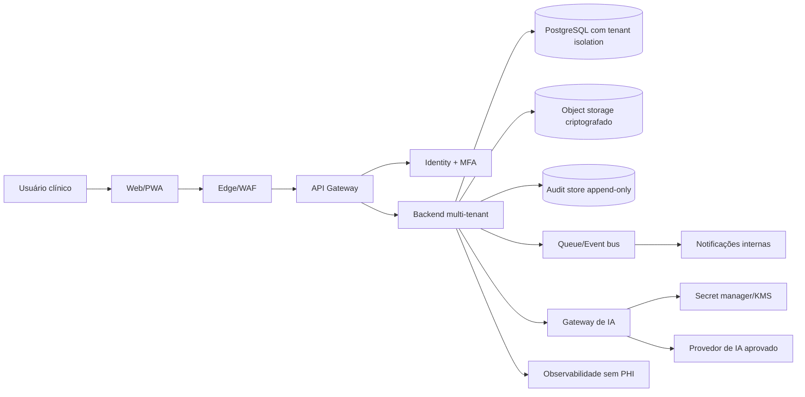

# Passagem UTI - Arquitetura Online Futura

**Status:** arquitetura-alvo; não implementada no baseline local  
**Princípio:** nenhum componente futuro deve ser descrito como já disponível

## 1. Baseline atual

### ATUAL - LOCAL

```text
Navegador local
  ├─ interface dos 10 leitos
  ├─ estado e anexos no IndexedDB
  └─ chamada ao servidor em 127.0.0.1
          ├─ lê a chave de arquivo local/variável
          └─ chama a OpenAI Responses API
```

Limitações conhecidas:

- Um navegador/perfil é a fronteira de persistência.
- Não há login, tenant, RBAC ou compartilhamento seguro.
- Não há sincronização, trilha de auditoria institucional ou recuperação central.
- Exportação JSON não é mecanismo de restore online.

## 2. Arquitetura-alvo

### FUTURO - ONLINE



## 3. Fronteiras de confiança

1. Dispositivo/navegador do usuário.
2. Edge público e API autenticada.
3. Serviços internos do tenant.
4. Banco e object storage clínicos.
5. Provedores externos aprovados.
6. Plano de administração e suporte.

Nenhuma fronteira deve confiar apenas em identificador vindo do cliente. `tenant_id`, permissões e escopo precisam ser derivados da sessão e verificados no backend.

## 4. Serviços propostos

| Serviço | Responsabilidade | Dados clínicos permitidos? |
|---|---|---|
| Identity | Login, MFA, sessão, recuperação | Não; somente identidade e atributos mínimos |
| API Gateway | Autorização inicial, rate limit, roteamento | Evitar payload em logs |
| Capsule Service | Cápsula, versões, timeline, tarefas, read-back | Sim, sob RBAC e tenant |
| File Service | Upload, varredura, criptografia e download assinado | Sim, storage clínico dedicado |
| AI Gateway | Minimização, policy checks, chamada e validação | Somente payload autorizado e efêmero |
| Audit Service | Eventos de acesso e mudança | Metadados; sem texto clínico integral |
| Notification Service | Eventos internos e preferências | Mínimo necessário; sem push contendo PHI |
| Metrics Service | Agregação de oportunidade/equidade | Somente dados agregados/deidentificados |

## 5. Multi-tenancy

Modelo inicial recomendado: banco lógico compartilhado com isolamento forte por `tenant_id`, Row-Level Security ou camada equivalente, e testes automáticos de não interferência. Tenants de maior risco podem migrar para isolamento físico.

Controles mínimos:

- `tenant_id` obrigatório e imutável em toda entidade.
- Autorização no serviço, não no frontend.
- Chaves de object storage prefixadas e validadas pelo backend.
- Filas, cache, busca e backups com escopo de tenant.
- Administração cross-tenant desabilitada por padrão.
- Testes IDOR/BOLA em cada endpoint.

## 6. Autenticação e RBAC

- OIDC/OAuth2 com PKCE.
- MFA obrigatório para dados clínicos.
- Tokens curtos, refresh rotativo e revogação.
- Sessões vinculadas a organização/unidade.
- Papéis: coordenador, diarista, plantonista.
- Permissões compostas por ação + recurso + escopo.
- Convites expiram e não concedem acesso antes da autenticação.
- Break-glass, se existir, exige justificativa, tempo limitado, notificação e auditoria.

Matriz de alto nível:

| Ação | Coordenador | Diarista | Plantonista |
|---|---:|---:|---:|
| Configurar unidade e membros | Sim | Não | Não |
| Ler cápsula da unidade durante vínculo | Sim* | Sim | Sim |
| Editar plano longitudinal | Conforme vínculo | Sim | Conforme turno |
| Registrar evento e pendência | Conforme vínculo | Sim | Sim |
| Confirmar read-back como receptor | Sim | Sim | Sim |
| Ver indicadores agregados | Sim | Limitado | Próprio contexto agregado |

`*` O coordenador não recebe acesso clínico irrestrito apenas pelo cargo; vínculo e finalidade devem ser configurados.

## 7. Dados e versionamento

### Cápsula viva

- `Capsule` identifica o fluxo longitudinal.
- `CapsuleVersion` é imutável após publicação.
- Eventos e tarefas referenciam a versão de origem.
- Read-back registra hash/ID da versão recebida.
- Mudança material cria nova versão e invalida recibo anterior.
- Transferência de leito preserva histórico, mas exige reconciliação explícita de identidade.

### Concorrência

- Optimistic concurrency com `version`/ETag.
- Idempotency key em comandos mutáveis.
- Conflitos exibem comparação e exigem escolha humana.
- Last-write-wins é proibido para conteúdo clínico.

## 8. Arquivos

- Upload por URL assinada de curta duração.
- Allowlist de tipos, limite de tamanho e verificação de MIME real.
- Varredura antimalware e quarentena.
- Criptografia com KMS; rotação de chaves.
- Downloads autorizados e auditados.
- Thumbnail sem expor o original em CDN pública.
- Exclusão lógica + fila de descarte + evidência de conclusão.

## 9. Gateway de IA

Fluxo obrigatório:

1. Autorizar usuário/tenant/unidade/cápsula.
2. Minimizar payload e remover campos não necessários.
3. Fixar `capsule_version_id`, leito e paciente contextual.
4. Recuperar credencial no secret manager em runtime.
5. Chamar provedor aprovado com timeout, rate limit e `store: false` quando aplicável.
6. Validar schema, número/ordem dos tópicos e identidade contextual.
7. Descartar resposta divergente ou obsoleta.
8. Registrar metadados técnicos sem prompt/resposta integral.

Proibido:

- Chave no frontend, `.env` versionado ou log.
- Chave por tenant armazenada em texto claro.
- Prompt clínico em APM, analytics, issue tracker ou chat de suporte.
- Retentativa ilimitada ou troca silenciosa de modelo.

## 10. Secret manager e criptografia

- Secret manager gerenciado para chaves de IA, banco, storage e integrações.
- KMS/HSM para chaves de criptografia.
- Rotação, versionamento, escopo por ambiente e acesso por workload identity.
- TLS moderno em trânsito; criptografia em repouso em banco, objeto, backup e auditoria.
- Nenhum segredo em GitHub, Notion, Drive/iCloud, imagem de container ou arquivo distribuído.

## 11. Auditoria

Eventos mínimos:

- Login, falha, MFA, convite e revogação.
- Leitura, criação, alteração, exportação e exclusão de cápsula/anexo.
- Mudança de papel/política.
- Chamada de IA, modelo, resultado técnico e descarte.
- Read-back e invalidação.
- Break-glass e ação de suporte.

Requisitos:

- Append-only, integridade verificável e relógio confiável.
- Acesso segregado e registrado.
- Retenção definida por finalidade e obrigação.
- Conteúdo clínico integral não entra no log padrão.

## 12. Modos

### UTI oficial

- Provisionamento institucional.
- Leitos, turnos e membros administrados.
- Retenção e integrações controladas pelo hospital.
- Continuidade persistente e relatórios agregados.

### Plantão ad hoc

- Workspace isolado com TTL.
- Convites nominativos, autenticados e revogáveis.
- Sem integração automática ao prontuário.
- Encerramento com exportação institucional aprovada ou descarte verificável.

## 13. Observabilidade

- Métricas: disponibilidade, latência, erro, fila, conflito, descartes da IA e saturação.
- Logs estruturados com redaction e allowlist de campos.
- Traces sem corpo clínico.
- Alertas técnicos separados de notificações clínicas/operacionais.
- SIEM recebe somente eventos necessários e minimizados.

## 14. Continuidade e recuperação

- Backups criptografados e isolados.
- RPO/RTO definidos antes do piloto.
- Restore testado em ambiente segregado.
- Runbooks de indisponibilidade e modo manual.
- Deploy canário, feature flags e rollback.
- Falha da IA não impede edição e transmissão manual.

## 15. Integrações futuras

Qualquer integração com prontuário, escala ou identidade exige contrato, DPIA/RIPD, mapeamento de finalidade e perfil de acesso. GitHub, Notion, Google Drive e iCloud não são destinos clínicos nem barramentos de sincronização.

## 16. Decisões pendentes

- Provedor de identidade e estratégia de federação hospitalar.
- Isolamento lógico versus físico por segmento.
- Região de dados, subprocessadores e transferência internacional.
- Política de retenção por modalidade e contrato.
- Padrão de interoperabilidade e instituição piloto.
- SLO/RPO/RTO e capacidade inicial.

## 17. Gates arquiteturais

Antes do piloto:

- Threat model aprovado.
- Teste de isolamento e autorização automatizado.
- Secret scanning e rotação demonstrados.
- Backup/restore e resposta a incidente exercitados.
- Observabilidade provada sem PHI.
- Safety case e RIPD aprovados.

